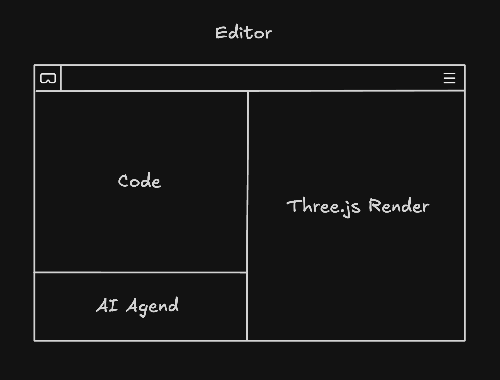
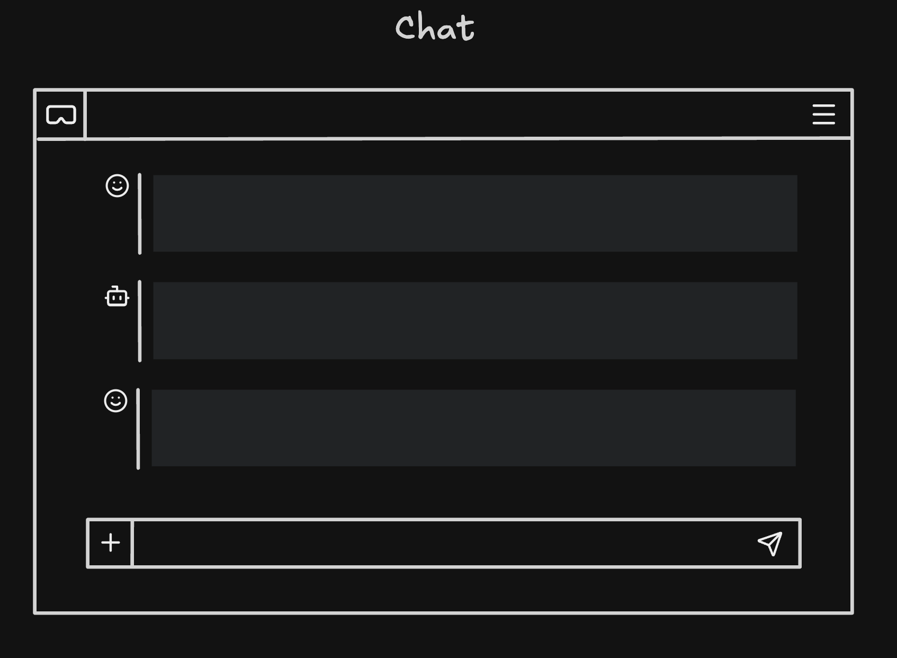
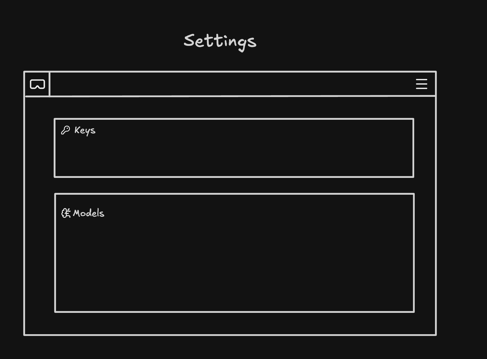

# three-js-vr-builder

> You currently need an OpenRouter API key.
> 🚧 This project is a work in progress.
> 🤖 Parts of this project were built with AI. I mainly use Codex with the OpenAI models OpenCode and Pi, and I work in 🩷 Zed.

`three-js-vr-builder` is an educational editor for learning three.js by writing, previewing, and iterating on scene code inside the app.

I built this project to help students work creatively with code.
The goal is not only to generate scenes, but to understand how three.js code, AI scaffolding, and smaller models actually work.
I also want to use smaller models on purpose. They should stay understandable, affordable, and replaceable.

This project is part of a collaboration with HTW Berlin and Futurium Lab.
If you want to contribute, send me a short note on GitHub. I would love more people to help build and explore this project. ✨

## What You Can Do

- `/editor`: write code, choose templates, preview scenes, and iterate with Pi
- `/chat`: use a separate chat surface with its own session scope
- `/settings`: configure your OpenRouter key and select a model

## Current Capabilities

- Managed editable scene files live under `static/three`.
- Starter templates live under `static/templates`.
- Scene files follow the shared `createDemoScene` contract.
- Scene files may optionally export `demoRendererKind = 'webgl' | 'webgpu'`.
- The preview runtime supports both `WebGLRenderer` and `WebGPURenderer`.
- Pi runs on the server only.
- Chat and editor share the configured key and model, but not the same session state.

## Quick Start 🚀

Install dependencies:

```sh
bun install
```

Start the development server:

```sh
bun run dev
```

Then:

1. Open `http://localhost:5173/settings`.
2. Add your OpenRouter API key.
3. Select a model.
4. Go to `http://localhost:5173/editor` or `http://localhost:5173/chat`.

`bun install` also runs `prepare`. That syncs SvelteKit and installs Playwright browsers for local test flows.

There is currently no required `.env` file for local development.
Keys, settings, and session files are stored outside the repository under `~/.three-js-vr-builder/pi`.

## Tech Stack

- `bun`
- `vite`
- `svelte 5`
- `@sveltejs/kit`
- `three`
- `@mariozechner/pi-coding-agent`
- `bits-ui`
- `codemirror`
- `esbuild`
- `biome`
- `vitest`
- `playwright`

## Wireframes 🎨







## Project Structure 🧱

- `src/routes`: main app surfaces and supporting endpoints
- `src/lib/components`: reusable primitive UI families and thin Bits UI wrappers
- `src/lib/blocks`: composed UI blocks built from local primitives
- `src/lib/features/editor`: CodeMirror integration, preview runtime, workspace state, template helpers, and editor transport
- `src/lib/features/chat`: browser-side chat transport and conversation state
- `src/lib/server/editor`: managed file access, workspace bootstrap loading, template discovery, and preview bundling
- `src/lib/server/pi`: server-only Pi integration, auth, model selection, sessions, and tool orchestration
- `static/templates`: teaching-oriented starter templates
- `static/three`: local managed workspace for editable scene files

## Validation 🧪

Run the core checks before opening a pull request:

```sh
bun run check
bunx biome check .
bun run test:unit -- --run
```

Additional commands:

```sh
bun run build
bun run test
```

## Further Reading

- [`CONTRIBUTING.md`](./CONTRIBUTING.md)
- [`NEXT-STEPS.md`](./NEXT-STEPS.md)
- [`src/lib/README.md`](./src/lib/README.md)
- [`src/lib/features/editor/README.md`](./src/lib/features/editor/README.md)
- [`src/lib/server/README.md`](./src/lib/server/README.md)
- [`src/lib/server/pi/README.md`](./src/lib/server/pi/README.md)
- [`src/lib/server/editor/README.md`](./src/lib/server/editor/README.md)
